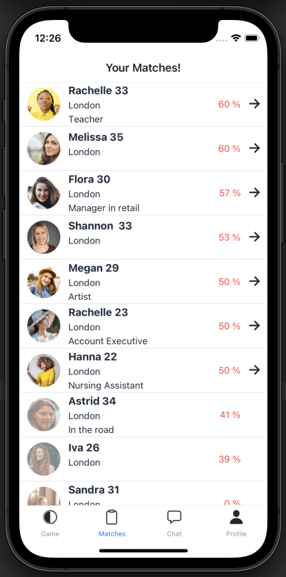

# MindFirst

Mind First is the dating app that makes it easy for you to engage on a conversation.

With Mind First you match with mindsets first then you'll have the feeling of engaging with people you already have a lot in common.

### How does it work?

- With Mind First there is no swiping on profiles for matches rather the user plays by answering a set of questions very quickly to establish common values and interests.
- A ranking of compatibility is established and the user can access other's people profile and engage.
- The ranking is dynamic and evolves every time a user answers a question bringing a totally new experience to the dating app game.
- The users can chat and access each other's profiles only if they have more than 50% of the same answers.
- By accessing the matched profile you find what you have and don't have in common which is very good starting point for a conversation.
***
- The Game play: Answer fast and capture your mindset! 
  - 
- The Ranking page. Constantly evolving.
  - 
- Your Match profile. Browse the pictures and the answers in common or not!
  - 
- Chat live!
  - 

### Features

- Ranking evolve notification. Brings randomness and action to navigate to the Matches page.
  - 
- Full profile Page
  - 
- Customise your preferences
  - 
- Pick and sort your pictures
  - 
- Security: block users
  - 

### Stack used

- React Native
- Expo
- AWS Amplify
  - App Sync
  - DynamoDB

#### Why did I stop the project?

I had a lot of fun developing this app and learnt a lot on the way. It was fantastic to receive very nice feedback and see that this project can have a potential. People loved it as it addressed what most people don't like about dating apps:
* The profile picture is visible first
* You are judged on your pictures only
* Hard to break the glass to engage in a conversation

So, why did I stop the development? Developing an app from scratch by yourself is hard and time-consuming. I am now dedicating this time for other activities and interest.
I am open sourcing it in hope that it will inspire someone.
